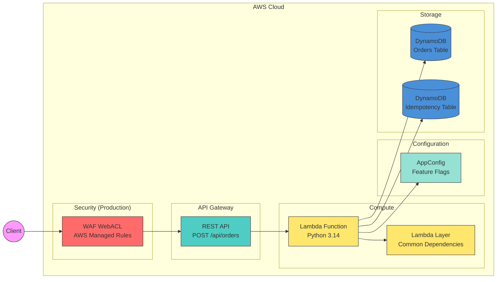
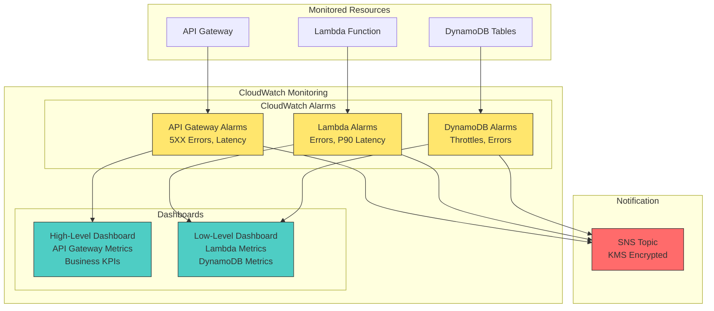

# AWS Serverless service cookiecutter (Python)

[](https://github.com/ran-isenberg/cookiecutter-serverless-python/blob/master/LICENSE)


This project can serve as a cookiecutter template for new Serverless services - CDK deployment code, pipeline and handler are covered with best practices built in.

The project is based on the [AWS Lambda Cookbook template project](https://github.com/ran-isenberg/aws-lambda-handler-cookbook).

## **Prerequisites**

* Python 3.14
* [uv](https://docs.astral.sh/uv/) - Install with ``curl -LsSf https://astral.sh/uv/install.sh | sh`` or ``brew install uv``
* **[AWS CDK](https://docs.aws.amazon.com/cdk/v2/guide/getting-started.html)** - Required for synth & deploying the AWS CloudFormation stack.
* For Windows based machines, use the Makefile_windows version (rename to Makefile). Default Makefile is for Mac/Linux.
* Cookiecutter - install with pip/brew ``brew install cookiecutter`` or ``pip install cookiecutter``

## Getting Started

```bash
cookiecutter gh:ran-isenberg/cookiecutter-serverless-python
```

Follow the cookiecutter questions:


### **Ready to deploy the service:**

```bash
cd {new repo folder}
make dev
make deploy
```

You can also run 'make pr' which will run all checks, synth, file formatters, unit tests, deploy to AWS and run integration and E2E tests.

For more information head over to project documentation pages at [https://ran-isenberg.github.io/aws-lambda-handler-cookbook](https://ran-isenberg.github.io/aws-lambda-handler-cookbook/)

The documentation provides information about CDK deployment, makefile commands, testing methodology and more.

## Serverless Service - The Order service

* This project provides a working orders service where customers can create orders of items.

* The project deploys an API GW with an AWS Lambda integration under the path POST /api/orders/ and stores data in a DynamoDB table.



### **Monitoring Design**



### **Features**

* Python Serverless service with a recommended file structure.
* CDK infrastructure with infrastructure tests and security tests.
* CI/CD pipelines based on GitHub Actions that deploy to AWS with Python linters, complexity checks and style formatters.
* CI/CD pipeline deploys to dev/staging and production environments with different gates between each environment.
* Automatic GitHub releases with semantic versioning based on conventional commits.
* Automatic PR labeling based on commit message prefixes (feat, fix, docs, chore).
* Makefile for simple developer experience.
* The AWS Lambda handler embodies Serverless best practices and has all the bells and whistles for a proper production ready handler.
* AWS Lambda handler uses [AWS Lambda Powertools](https://docs.powertools.aws.dev/lambda-python/).
* AWS Lambda handler 3 layer architecture: handler layer, logic layer and data access layer.
* Feature flags and configuration based on AWS AppConfig.
* Idempotent API.
* REST API protected by WAF with four AWS managed rules in production deployment.
* CloudWatch dashboards - High level and low level including CloudWatch alarms.
* Unit, infrastructure, security, integration and end to end tests.
* Automatically generated OpenAPI endpoint: /swagger with Pydantic schemas for both requests and responses.
* CI swagger protection - fails the PR if your swagger JSON file (stored at docs/swagger/openapi.json) is out of date.
* Automated protection against API breaking changes.

## CDK Deployment

The CDK code creates an API GW with a path of /api/orders which triggers the Lambda on 'POST' requests.

The AWS Lambda handler uses a Lambda layer optimization which takes all the packages under the dependencies section in pyproject.toml and bundles them via a requirements export.

This allows you to package any custom dependencies you might have, just add them to pyproject.toml under the dependencies section.

## Serverless Best Practices

The AWS Lambda handler implements multiple best practice utilities.

Each utility is implemented when a new blog post is published about that utility.

The utilities cover multiple aspects of a production-ready service, including:

* [Logging](https://ranthebuilder.cloud/post/aws-lambda-cookbook-elevate-your-handler-s-code-part-1-logging/)
* [Observability: Monitoring and Tracing](https://ranthebuilder.cloud/post/aws-lambda-cookbook-elevate-your-handler-s-code-part-2-observability/)
* [Observability: Business KPIs Metrics](https://ranthebuilder.cloud/post/aws-lambda-cookbook-elevate-your-handler-s-code-part-3-business-domain-observability/)
* [Environment Variables](https://ranthebuilder.cloud/post/aws-lambda-cookbook-environment-variables/)
* [Input Validation](https://ranthebuilder.cloud/post/aws-lambda-cookbook-elevate-your-handler-s-code-part-5-input-validation/)
* [Dynamic Configuration & feature flags](https://ranthebuilder.cloud/post/aws-lambda-cookbook-part-6-feature-flags-configuration-best-practices/)
* [Start Your AWS Serverless Service With Two Clicks](https://ranthebuilder.cloud/post/aws-lambda-cookbook-part-7-how-to-use-the-aws-lambda-cookbook-github-template-project/)
* [CDK Best practices](https://ranthebuilder.cloud/blog/aws-cdk-best-practices-from-the-trenches/)
* [Serverless Monitoring](https://ranthebuilder.cloud/post/how-to-effortlessly-monitor-serverless-applications-with-cloudwatch-part-one/)
* [API Idempotency](https://ranthebuilder.cloud/post/serverless-api-idempotency-with-aws-lambda-powertools-and-cdk/)
* [Serverless OpenAPI Documentation with AWS Powertools](https://ranthebuilder.cloud/post/serverless-open-api-documentation-with-aws-powertools/)

### Makefile Commands

#### **Creating a Developer Environment**

1. Run ``make dev`` - This will install uv, sync dependencies, and set up pre-commit hooks

#### **Deploy CDK**

Create a CloudFormation stack by running ``make deploy``.

#### **Unit Tests**

Unit tests can be found under the ``tests/unit`` folder.

You can run the tests by using the following command: ``make unit``.

#### **Integration Tests**

Make sure you deploy the stack first as these tests trigger your Lambda handler LOCALLY but they can communicate with AWS services.

These tests allow you to debug in your IDE your AWS Lambda function.

Integration tests can be found under the ``tests/integration`` folder.

You can run the tests by using the following command: ``make integration``.

#### **E2E Tests**

Make sure you deploy the stack first.

E2E tests can be found under the ``tests/e2e`` folder.

These tests send a 'POST' message to the deployed API GW and trigger the Lambda function on AWS.

The tests are run automatically by: ``make e2e``.

#### **Deleting the stack**

CDK destroy can be run with ``make destroy``.

#### **Preparing Code for PR**

Run ``make pr``. This command will run all the required checks, pre-commit hooks, linters, code formatters and tests, so you can be sure GitHub's pipeline will pass.

The command auto fixes errors in the code for you.

If there's an error in the pre-commit stage, it gets auto fixed. However, you are required to run ``make pr`` again so it continues to the next stages.

Be sure to commit all the changes that ``make pr`` does for you.

## Code Contributions

Code contributions are welcomed. Read the [contributing guide.](https://github.com/ran-isenberg/aws-lambda-handler-cookbook/blob/main/CONTRIBUTING.md)

## Code of Conduct

Read our [code of conduct.](https://github.com/ran-isenberg/aws-lambda-handler-cookbook/blob/main/CODE_OF_CONDUCT.md)

## Connect

* Email: [ran.isenberg@ranthebuilder.cloud](mailto:ran.isenberg@ranthebuilder.cloud)
* Blog Website [RanTheBuilder](https://ranthebuilder.cloud/)
* LinkedIn: [ranisenberg](https://www.linkedin.com/in/ranbuilder/)
* Bluesky: [@ranthebuilder.cloud](https://bsky.app/profile/ranthebuilder.cloud)

## Credits

* [AWS Lambda Powertools (Python)](https://github.com/aws-powertools/powertools-lambda-python)

## License

This library is licensed under the MIT License. See the [LICENSE](https://github.com/ran-isenberg/cookiecutter-serverless-python/blob/main/LICENSE) file.
